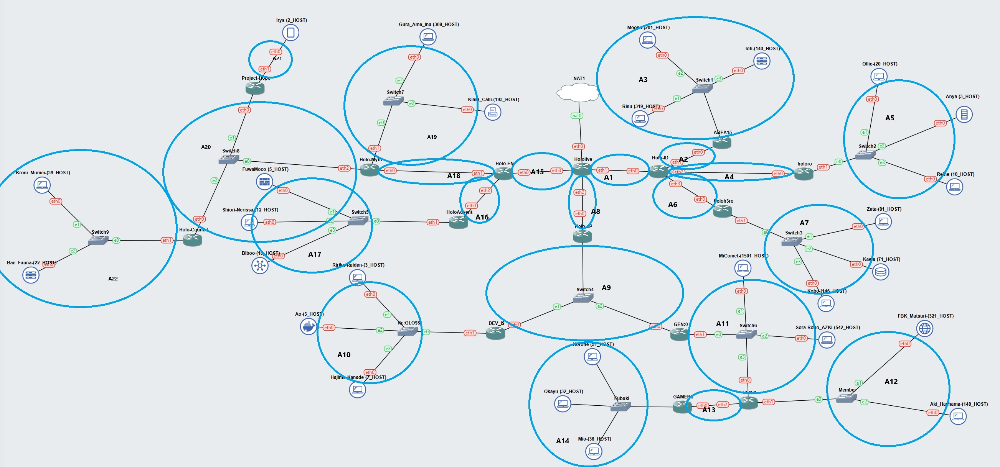
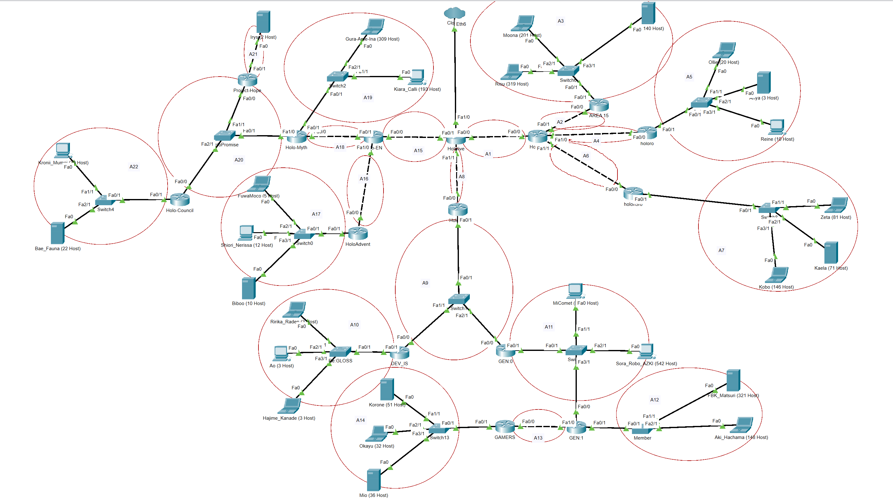
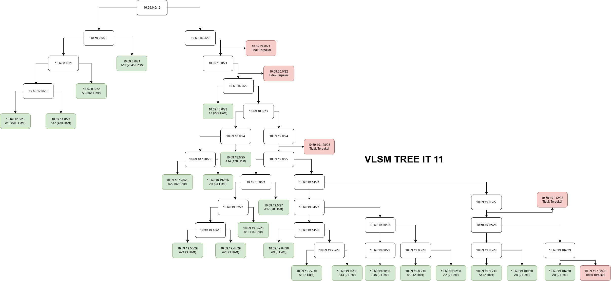

# Laporan Resmi Jarkom Modul 4

| Nama | NRP |
| --- | --- |
| Aryasatya Alaauddin | 5027231082 |
| Almendo Jekson Darwin Naftali Kambu | 5027221073 |





## Subnet Details

| **Nama Subnet** | **Rute** | **Jumlah IP** | **Netmask** |
| --- | --- | --- | --- |
| A1 | Hololive > HoloID | 2 | /30 |
| A2 | Hololive > HoloID > AREA-15 | 2 | /30 |
| A3 | Hololive > HoloID > AREA-15 > Switch6 > Moona + Risu + lofi | 661 | /22 |
| A4 | Hololive > HoloID > holoro | 2 | /30 |
| A5 | Hololive > HoloID > holoro > Switch7 > Ollie + Anya + Reine | 34 | /26 |
| A6 | Hololive > HoloID > holoh3ro | 2 | /30 |
| A7 | Hololive > HoloID > holoh3ro > Switch8 > Zeta + Kaela + Kobo | 299 | /23 |
| A8 | Hololive > HoloJP | 2 | /30 |
| A9 | Hololive > HoloJP > Switch1 > DEV_IS + GEN:0 | 3 | /29 |
| A10 | Hololive > HoloJP > Switch1 > DEV_IS > Re:Gloss > Ririka_Raden + Ao + Hajime_Kanade | 14 | /28 |
| A11 | Hololive > HoloJP > Switch1 > GEN:0 > Switch3 > MiComet + Sora_Robo_AZK + GEN:1 | 2045 | /21 |
| A12 | Hololive > HoloJP > Switch1 > GEN:0 > Switch3 > GEN:1 > Member > FBK_Matsuri + Aki_Hachama | 470 | /23 |
| A13 | Hololive > HoloJP > Switch1 > GEN:0 > Switch3 > GEN:1 > GAMERS | 2 | /30 |
| A14 | Hololive > HoloJP > Switch1 > GEN:0 > Switch3 > GEN:1 > GAMERS > Fubuki > Korone + Okayu + Mio | 120 | /25 |
| A15 | Hololive > HoloEN | 2 | /30 |
| A16 | Hololive > HoloEN > HoloAdvent | 2 | /30 |
| A17 | Hololive > HoloEN > HoloAdvent > Switch0 > FuwaMoco + Shiori_Nerissa + Biboo | 28 | /27 |
| A18 | Hololive > HoloEN > Holo-Myth | 2 | /30 |
| A19 | Hololive > HoloEN > Holo-Myth > Switch2 > Gura_Ame_Ina + Kiara_Calli | 503 | /23 |
| A20 | Hololive > HoloEN > Holo-Myth > HoloPromise > Project-Hope + Holo_Council | 3 | /29 |
| A21 | Hololive > HoloEN > Holo-Myth > HoloPromise > Project-Hope > Irys | 3 | /29 |
| A22 | Hololive > HoloEN > Holo-Myth > HoloPromise > Holo-Council > Switch4 > Kronii_Mumei + Bae_Fauna | 62 | /26 |

### Total

- **Jumlah IP:** 4263
- **Netmask:** /19

## CPT + VLSM



| **Subnet** | **Network ID** | **Netmask** | **Broadcast** | **Range IP** |
| --- | --- | --- | --- | --- |
| A11 | 10.69.0.0 | 255.255.248.0 | 10.69.7.255 | 10.69.0.1 - 10.69.7.254 |
| A3 | 10.69.8.0 | 255.255.252.0 | 10.69.11.255 | 10.69.8.1 - 10.69.11.254 |
| A7 | 10.69.12.0 | 255.255.254.0 | 10.69.13.255 | 10.69.12.1 - 10.69.13.254 |
| A12 | 10.69.14.0 | 255.255.254.0 | 10.69.15.255 | 10.69.14.1 - 10.69.15.254 |
| A19 | 10.69.16.0 | 255.255.254.0 | 10.69.17.255 | 10.69.16.1 - 10.69.17.254 |
| A14 | 10.69.18.0 | 255.255.255.128 | 10.69.18.127 | 10.69.18.1 - 10.69.18.126 |
| A22 | 10.69.18.128 | 255.255.255.192 | 10.69.18.191 | 10.69.18.129 - 10.69.18.190 |
| A5 | 10.69.18.192 | 255.255.255.192 | 10.69.18.255 | 10.69.18.193 - 10.69.18.254 |
| A17 | 10.69.19.0 | 255.255.255.224 | 10.69.19.31 | 10.69.19.1 - 10.69.19.30 |
| A10 | 10.69.19.32 | 255.255.255.240 | 10.69.19.47 | 10.69.19.33 - 10.69.19.46 |
| A21 | 10.69.19.48 | 255.255.255.248 | 10.69.19.55 | 10.69.19.49 - 10.69.19.50 |
| A20 | 10.69.19.56 | 255.255.255.248 | 10.69.19.63 | 10.69.19.57 - 10.69.19.58 |
| A9 | 10.69.19.64 | 255.255.255.248 | 10.69.19.71 | 10.69.19.65 - 10.69.19.66 |
| A1 | 10.69.19.72 | 255.255.255.252 | 10.69.19.75 | 10.69.19.73 - 10.69.19.74 |
| A2 | 10.69.19.76 | 255.255.255.252 | 10.69.19.79 | 10.69.19.77 - 10.69.19.78 |
| A4 | 10.69.19.80 | 255.255.255.252 | 10.69.19.83 | 10.69.19.81 - 10.69.19.82 |
| A6 | 10.69.19.84 | 255.255.255.252 | 10.69.19.87 | 10.69.19.85 - 10.69.19.86 |
| A8 | 10.69.19.88 | 255.255.255.252 | 10.69.19.91 | 10.69.19.89 - 10.69.19.90 |
| A13 | 10.69.19.92 | 255.255.255.252 | 10.69.19.95 | 10.69.19.93 - 10.69.19.94 |
| A15 | 10.69.19.96 | 255.255.255.252 | 10.69.19.99 | 10.69.19.97 - 10.69.19.98 |
| A16 | 10.69.19.100 | 255.255.255.252 | 10.69.19.103 | 10.69.19.101 - 10.69.19.102 |
| A18 | 10.69.19.104 | 255.255.255.252 | 10.69.19.107 | 10.69.19.105 - 10.69.19.106 |

Total: 4263

Netmask: /19

## Subnet A1

Hololive (Router)

```bash
enable
configure terminal
interface fa0/0
ip address 10.69.19.73 255.255.255.252
no shutdown
```

Holo-ID (Router)

```bash
enable
configure terminal
interface fa0/0
ip address 10.69.19.74 255.255.255.252
no shutdown
```

## Subnet A2

Holo-ID (Router)

```bash
enable
configure terminal
interface fa0/1
ip address 10.69.19.93 255.255.255.252
no shutdown
```

AREA15 (Router)

```bash
enable
configure terminal
interface fa0/0
ip address 10.69.19.94 255.255.255.252
no shutdown
```

## Subnet A3

AREA15 (Router)

```bash
enable
configure terminal
interface fa0/1
ip address 10.69.8.1 255.255.252.0
no shutdown
```

Moona (Device)

```bash
Interface: fa0
IP Address: 10.69.8.2
Subnet Mask: 255.255.252.0
Gateway: 10.69.8.1
```

Risu (Device)

```bash
Interface: fa0
IP Address: 10.69.8.3
Subnet Mask: 255.255.252.0
Gateway: 10.69.8.1
```

lofi (Device)

```bash
Interface: fa0
IP Address: 10.69.8.4
Subnet Mask: 255.255.252.0
Gateway: 10.69.8.1
```

## Subnet A4

**Holo-ID (Router)**

```bash
enable
configure terminal
interface fa1/0
ip address 10.69.19.97 255.255.255.252
no shutdown
```

**holoro (Router)**

```bash
enable
configure terminal
interface fa0/0
ip address 10.69.19.98 255.255.255.252
no shutdown
```

## Subnet A5

**holoro (Router)**

```bash
enable
configure terminal
interface fa0/1
ip address 10.69.18.193 255.255.255.192
no shutdown
```

**Ollie (Device)**

```bash
Interface fa0
IP Address: 10.69.18.194
Subnet Mask: 255.255.255.192
Gateway: 10.69.18.193
```

**Anya (Device)**

```bash
Interface fa0
IP Address: 10.69.18.195
Subnet Mask: 255.255.255.192
Gateway: 10.69.18.193
```

**Reine (Device)**

```bash
Interface fa0
IP Address: 10.69.18.196
Subnet Mask: 255.255.255.192
Gateway: 10.69.18.193
```

## Subnet A6

**Holo-ID (Router)**

```bash
enable
configure terminal
interface fa1/1
ip address 10.69.19.101 255.255.255.252
no shutdown
```

**holoh3ro (Router)**

```bash
enable
configure terminal
interface fa0/0
ip address 10.69.19.102 255.255.255.252
no shutdown
```

## Subnet A7

**holoh3ro (Router)**

```bash
enable
configure terminal
interface fa0/1
ip address 10.69.16.1 255.255.254.0
no shutdown
```

**Zeta (Device)**

```bash
Interface fa0
IP Address: 10.69.16.2
Subnet Mask: 255.255.254.0
Gateway: 10.69.16.1
```

**Kaela (Device)**

```bash
Interface fa0
IP Address: 10.69.16.3
Subnet Mask: 255.255.254.0
Gateway: 10.69.16.1
```

**Kobo (Device)**

```bash
Interface fa0
IP Address: 10.69.16.4
Subnet Mask: 255.255.254.0
Gateway: 10.69.16.1
```

## Subnet A8

**Hololive (Router)**

```bash
enable
configure terminal
interface fa1/1
ip address 10.69.19.105 255.255.255.252
no shutdown
```

**HoloJP (Router)**

```bash
enable
configure terminal
interface fa0/0
ip address 10.69.19.106 255.255.255.252
no shutdown
```

## **Subnet A9**

**HoloJP (Router)**

```bash
enable
configure terminal
interface fa0/1
ip address 10.69.19.65 255.255.255.248
no shutdown
```

**DEV_IS (Router)**

```bash
enable
configure terminal
interface fa0/0
ip address 10.69.19.66 255.255.255.248
no shutdown
```

**GEN:0 (Router)**

```bash
enable
configure terminal
interface fa0/0
ip address 10.69.19.67 255.255.255.248
no shutdown
```

## **Subnet A10**

**DEV_IS (Router)**

```bash
enable
configure terminal
interface fa0/1
ip address 10.69.19.33 255.255.255.240
no shutdown
```

**Ririka_Rade (Device)**

```bash
Interface fa0
IP Address: 10.69.19.34
Subnet Mask: 255.255.255.240
Gateway: 10.69.19.33
```

**Ao (Device)**

```bash
Interface fa0
IP Address: 10.69.19.35
Subnet Mask: 255.255.255.240
Gateway: 10.69.19.33
```

**Hajime_Kanade (Device)**

```bash
Interface fa0
IP Address: 10.69.19.36
Subnet Mask: 255.255.255.240
Gateway: 10.69.19.33
```

## **Subnet A11**

**GEN:0 (Router)**

```bash
enable
configure terminal
interface fa0/1
ip address 10.69.0.1 255.255.248.0
no shutdown
```

**GEN:1 (Router)**

```bash
enable
configure terminal
interface fa0/0
ip address 10.69.0.2 255.255.248.0
no shutdown
```

**MiComet (Device)**

```bash
Interface fa0
IP Address: 10.69.0.3
Subnet Mask: 255.255.248.0
Gateway: 10.69.0.1
```

**Sora_Robo_AZK (Device)**

```bash
Interface fa0
IP Address: 10.69.0.4
Subnet Mask: 255.255.248.0
Gateway: 10.69.0.1
```

## **Subnet A12**

**GEN:1 (Router)**

```bash
enable
configure terminal
interface fa0/1
ip address 10.69.14.1 255.255.254.0
no shutdown
```

**FBK_Matsuri (Device)**

```bash
Interface fa0
IP Address: 10.69.14.2
Subnet Mask: 255.255.254.0
Gateway: 10.69.14.1
```

**Aki_Hachama (Device)**

```bash
Interface fa0
IP Address: 10.69.14.3
Subnet Mask: 255.255.254.0
Gateway: 10.69.14.1
```

## **Subnet A13**

**GEN:1 (Router)**

```bash
enable
configure terminal
interface fa1/0
ip address 10.69.19.77 255.255.255.252
no shutdown
```

**GAMERS (Router)**

```bash
enable
configure terminal
interface fa0/0
ip address 10.69.19.78 255.255.255.252
no shutdown
```

## **Subnet A14**

**GAMERS (Router)**

```bash
enable
configure terminal
interface fa0/1
ip address 10.69.18.1 255.255.255.128
no shutdown
```

**Kerone (Device)**

```bash
Interface fa0
IP Address: 10.69.18.2
Subnet Mask: 255.255.255.128
Gateway: 10.69.18.1
```

**Okayu (Device)**

```bash
Interface fa0
IP Address: 10.69.18.3
Subnet Mask: 255.255.255.128
Gateway: 10.69.18.1
```

**Mio (Device)**

```bash
Interface fa0
IP Address: 10.69.18.4
Subnet Mask: 255.255.255.128
Gateway: 10.69.18.1
```

## **Subnet A15**

**Hololive (Router)**

```bash
enable
configure terminal
interface fa0/1
ip address 10.69.19.81 255.255.255.252
no shutdown
```

**HoloEN (Router)**

```bash
enable
configure terminal
interface fa0/0
ip address 10.69.19.82 255.255.255.252
no shutdown
```

## **Subnet A16**

**HoloEN (Router)**

```bash
enable
configure terminal
interface fa1/0
ip address 10.69.19.85 255.255.255.252
no shutdown
```

**HoloAdvent (Router)**

```bash
enable
configure terminal
interface fa0/0
ip address 10.69.19.86 255.255.255.252
no shutdown
```

## **Subnet A17**

**HoloAdvent (Router)**

```bash
enable
configure terminal
interface fa0/1
ip address 10.69.19.1 255.255.255.224
no shutdown
```

**FuwaMoco (Device)**

```bash
Interface fa0
IP Address: 10.69.19.2
Subnet Mask: 255.255.224.0
Gateway: 10.69.19.1
```

**Shiori_Nerissa (Device)**

```bash
Interface fa0
IP Address: 10.69.19.3
Subnet Mask: 255.255.224.0
Gateway: 10.69.19.1
```

**Biboo (Device)**

```bash
Interface fa0
IP Address: 10.69.19.4
Subnet Mask: 255.255.224.0
Gateway: 10.69.19.1
```

## **Subnet A18**

**HoloEN (Router)**

```bash
enable
configure terminal
interface fa0/1
ip address 10.69.19.89 255.255.255.252
no shutdown
```

**Holo-Myth (Router)**

```bash
enable
configure terminal
interface fa0/0
ip address 10.69.19.90 255.255.255.252
no shutdown
```

## **Subnet A19**

**Holo-Myth (Router)**

```bash
enable
configure terminal
interface fa0/1
ip address 10.69.12.1 255.255.254.0
no shutdown
```

**Gura_Ame_Ina (Device)**

```bash
Interface fa0
IP Address: 10.69.12.2
Subnet Mask: 255.255.254.0
Gateway: 10.69.12.1
```

**Kiara_Calli (Device)**

```bash
Interface fa0
IP Address: 10.69.12.3
Subnet Mask: 255.255.254.0
Gateway: 10.69.12.1
```

## **Subnet A20**

**Holo-Myth (Router)**

```bash
enable
configure terminal
interface fa1/0
ip address 10.69.19.49 255.255.255.248
no shutdown
```

**Project-Hope (Router)**

```bash
enable
configure terminal
interface fa0/0
ip address 10.69.19.50 255.255.255.248
no shutdown
```

**Holo-Council (Router)**

```bash
enable
configure terminal
interface fa0/0
ip address 10.69.19.51 255.255.255.248
no shutdown
```

## **Subnet A21**

**Project-Hope (Router)**

```bash
enable
configure terminal
interface fa0/1
ip address 10.69.19.57 255.255.255.248
no shutdown
```

**Irys (Device)**

```bash
Interface fa0
IP Address: 10.69.19.58
Subnet Mask: 255.255.255.248
Gateway: 10.69.19.57
```

## **Subnet A22**

**Holo-Council (Router)**

```bash
enable
configure terminal
interface fa0/1
ip address 10.69.18.129 255.255.255.192
no shutdown
```

**Kronii_Mumei (Device)**

```bash
Interface fa0
IP Address: 10.69.18.130
Subnet Mask: 255.255.255.192
Gateway: 10.69.18.129
```

**Bae_Fauna (Device)**

```bash
Interface fa0
IP Address: 10.69.18.131
Subnet Mask: 255.255.255.192
Gateway: 10.69.18.129
```

## **Konfigurasi Routing**

**Sisi Kanan (Holo-ID)**

**Hololive**

```
enable
configure terminal
ip route 10.69.19.92 255.255.255.252 10.69.19.74
ip route 10.69.8.0 255.255.252.0 10.69.19.74
ip route 10.69.19.96 255.255.255.252 10.69.19.74
ip route 10.69.18.192 255.255.255.192 10.69.19.74
ip route 10.69.19.100 255.255.255.252 10.69.19.74
ip route 10.69.16.0 255.255.254.0 10.69.19.74
do write

```

**Holo-ID**

```
enable
configure terminal
ip route 0.0.0.0 0.0.0.0 10.69.19.73
ip route 10.69.8.0 255.255.252.0 10.69.19.94
ip route 10.69.18.192 255.255.255.192 10.69.19.98
ip route 10.69.16.0 255.255.254.0 10.69.19.102
do write

```

**AREA15**

```
enable
configure terminal
ip route 0.0.0.0 0.0.0.0 10.69.19.93
do write

```

**holoro**

```
enable
configure terminal
ip route 0.0.0.0 0.0.0.0 10.69.19.97
do write

```

**holoh3ro**

```
enable
configure terminal
ip route 0.0.0.0 0.0.0.0 10.69.19.101
do write

```

**Sisi Bawah (HoloJP)**

**Hololive**

```
enable
configure terminal
ip route 10.69.19.64 255.255.255.248 10.69.19.106
ip route 10.69.19.32 255.255.255.240 10.69.19.106
ip route 10.69.0.0 255.255.248.0 10.69.19.106
ip route 10.69.14.0 255.255.254.0 10.69.19.106
ip route 10.69.19.76 255.255.255.252 10.69.19.106
ip route 10.69.18.0 255.255.255.128 10.69.19.106
do write

```

**HoloJP**

```
enable
configure terminal
ip route 0.0.0.0 0.0.0.0 10.69.19.105
ip route 10.69.19.32 255.255.255.240 10.69.19.66
ip route 10.69.0.0 255.255.248.0 10.69.19.67
ip route 10.69.14.0 255.255.254.0 10.69.19.67
ip route 10.69.19.76 255.255.255.252 10.69.19.67
ip route 10.69.18.0 255.255.255.128 10.69.19.67
do write

```

**DEV_IS**

```
enable
configure terminal
ip route 0.0.0.0 0.0.0.0 10.69.19.65
ip route 10.69.0.0 255.255.248.0 10.69.19.67
ip route 10.69.14.0 255.255.254.0 10.69.19.67
ip route 10.69.19.76 255.255.255.252 10.69.19.67
ip route 10.69.18.0 255.255.255.128 10.69.19.67
do write

```

**GEN:0**

```
enable
configure terminal
ip route 0.0.0.0 0.0.0.0 10.69.19.65
ip route 10.69.19.32 255.255.255.240 10.69.19.66
ip route 10.69.14.0 255.255.254.0 10.69.0.2
ip route 10.69.19.76 255.255.255.252 10.69.0.2
ip route 10.69.18.0 255.255.255.128 10.69.0.2
do write

```

**GEN:1**

```
enable
configure terminal
ip route 0.0.0.0 0.0.0.0 10.69.0.1
ip route 10.69.18.0 255.255.255.128 10.69.19.78
do write

```

**GAMERS**

```
enable
configure terminal
ip route 0.0.0.0 0.0.0.0 10.69.19.77
do write

```

**Sisi Kiri (HoloEN)**

**Hololive**

```
enable
configure terminal
ip route 10.69.19.84 255.255.255.252 10.69.19.82
ip route 10.69.19.0 255.255.255.224 10.69.19.82
ip route 10.69.19.88 255.255.255.252 10.69.19.82
ip route 10.69.12.0 255.255.254.0 10.69.19.82
ip route 10.69.19.48 255.255.255.248 10.69.19.82
ip route 10.69.19.56 255.255.255.248 10.69.19.82
ip route 10.69.18.128 255.255.255.192 10.69.19.82
do write

```

**HoloEN**

```
enable
configure terminal
ip route 0.0.0.0 0.0.0.0 10.69.19.81
ip route 10.69.19.0 255.255.255.224 10.69.19.86
ip route 10.69.12.0 255.255.254.0 10.69.19.90
ip route 10.69.19.48 255.255.255.248 10.69.19.90
ip route 10.69.19.56 255.255.255.248 10.69.19.90
ip route 10.69.18.128 255.255.255.192 10.69.19.90
do write

```

**HoloAdvent**

```
enable
configure terminal
ip route 0.0.0.0 0.0.0.0 10.69.19.85
do write

```

**Holo-Myth**

```
enable
configure terminal
ip route 0.0.0.0 0.0.0.0 10.69.19.89
ip route 10.69.19.56 255.255.255.248 10.69.19.50
ip route 10.69.18.128 255.255.255.192 10.69.19.51
do write

```

**Project-Hope**

```
enable
configure terminal
ip route 0.0.0.0 0.0.0.0 10.69.19.49
ip route 10.69.18.128 255.255.255.192 10.69.19.51
do write

```

**Holo-Council**

```bash
enable
configure terminal
ip route 0.0.0.0 0.0.0.0 10.69.19.49
ip route 10.69.19.56 255.255.255.248 10.69.19.50
do write
```

## Testing

Antar Router


Antar Device

